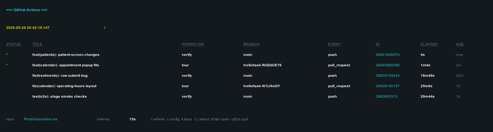
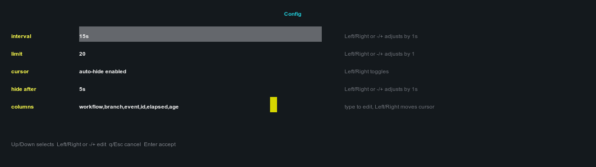

# git-board

Live terminal dashboard for GitHub Actions runs.

`git-board` uses the GitHub CLI for data, so it reuses your existing `gh auth`
session and repository access.

## Screenshots

Example dashboard using `ProdVision/clinic-os`:



Focused config panel:



## Requirements

- Rust/Cargo
- GitHub CLI (`gh`)
- `gh auth login` with access to the repository workflows

## Usage

```sh
git-board --repo owner/name
```

When `--repo` is omitted, `git-board` runs `gh repo view --json nameWithOwner`
from the current directory and monitors that repository.

Useful options:

```sh
git-board --repo owner/name --interval 10s --limit 30
git-board --columns status,title,workflow,branch,event,id,elapsed,age
git-board --pr-columns status,title,author,branch,base,number,age,updated
git-board --branch main --workflow verify --status in_progress
git-board --no-cursor-auto-hide
git-board --cursor-hide-after 10s
git-board --global
```

`--global` shares a temporary cache between `git-board` clients opened on the
same repository. The first client owns refreshes and writes the cache; other
clients read it. The cache is removed when the last client for that repository
exits.

Keys:

- `r`: refresh immediately
- `⇥`: switch between GitHub Actions and open pull request screens
- `h`: toggle cursor auto-hide
- `c`: show focused config panel
- `k`: show key commands
- `␣`: quick look at the selected row
- `↑` / `↓`: move selection
- `↵`: open the selected run or pull request in the browser
- `q` / `ESC`: close panel / quit

In the quick look panel, `↑` / `↓` scrolls overflowing row data, and
`␣`, `q`, or `ESC` closes it.

In the config panel, `↑` / `↓` changes the focused setting, `←` /
`→`, `-`, and `+` edit values, `←` / `→` moves the cursor inside
the columns field, `↵` accepts the draft settings, and `q` / `ESC` cancels
without applying changes.

## Configuration

Config is loaded from `~/.config/git-board/config.toml`. CLI flags override
config values.

```toml
repo = "owner/name"
interval = "15s"
limit = 20
columns = ["status", "title", "workflow", "branch", "event", "id", "elapsed", "age"]
pr_columns = ["status", "title", "author", "branch", "base", "number", "age", "updated"]

[cursor]
auto_hide = true
hide_after = "5s"

[filters]
branch = ""
workflow = ""
status = ""
event = ""
```
